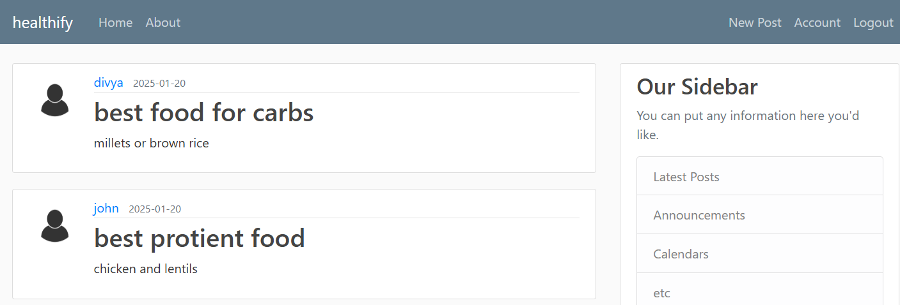
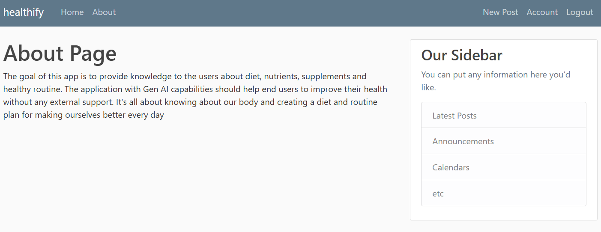
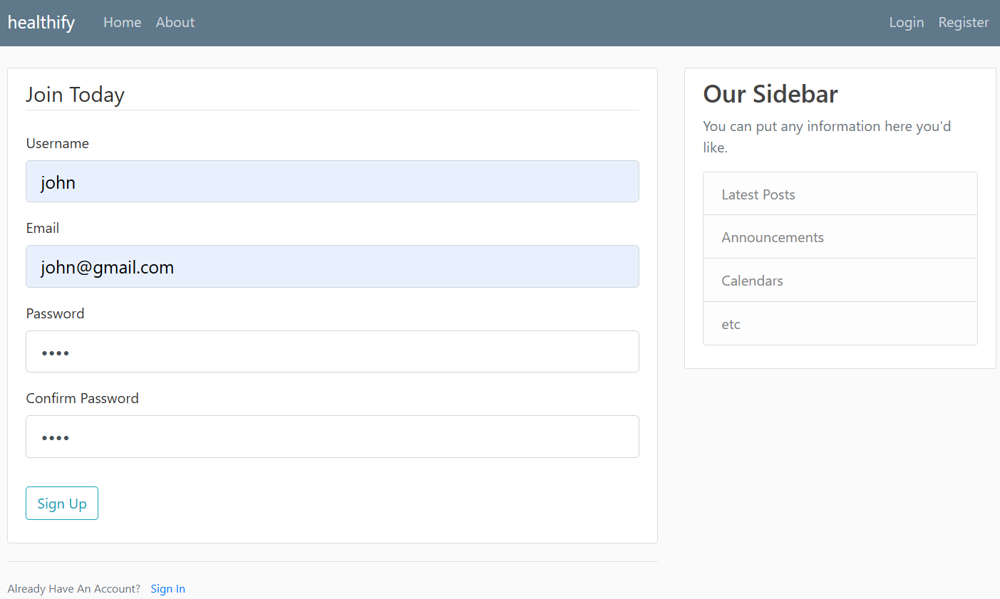
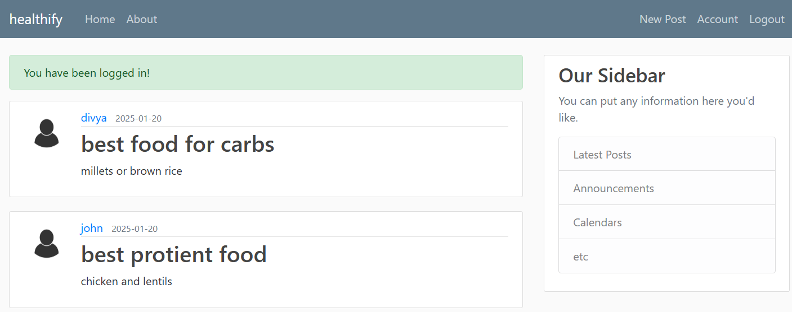
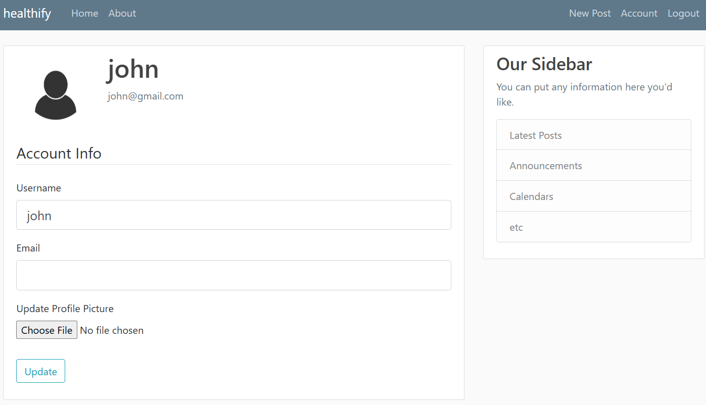
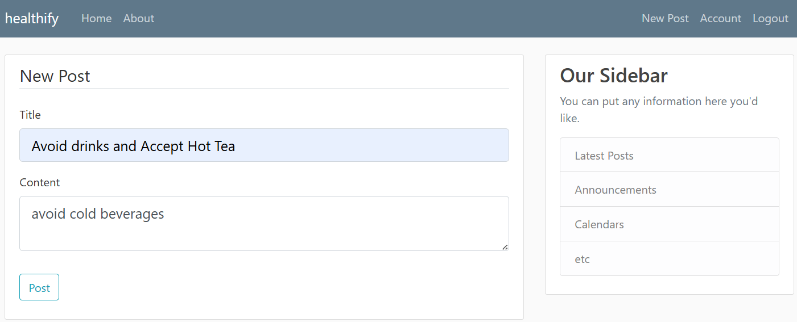

# Project Title

This project aim to learn python flask and create a web application project on windows and help end users with diet and routine. This project is still in enhancement stage and will be updating with repo with latest code.

* The web application goal is to create awareness on food nutrition, diet and supplements
* The application will receive inputs from end user and generate or suggest a diet plan and routine to avoid health issues

## Technical Details

    ### Description
    1. create python virtual Environment 
    2. build web application

    ### Create Python Virtual Environment
    1. Open cmd and go to required folder
    cd c:\Users\vkant\PycharmProjects
    
    2. create virutal environment using below command
        > python -m venv env_name (below is sample code)
        > python -m venv project_flask
    
    3. Activate the virtual environment
        > project_flask\Scripts\activate.bat 
        
    4. Identify the python installed location 
    > where python
    
    5. Get pip package details
        > pip list
        
    6. Get the list of libraries 
        > pip freeze
    
        get the list of libraries and place it into a requirements.txt file and execute it in virtual environment to replicate all those libraries. Go to project_flask folder and run below command
        > pip install -r Requirements.txt     

    7.  Flask specific environment variables setup
        - FLASK_APP: Specifies the name of the module to run when using flask run.
        - FLASK_ENV: Sets the environment (e.g., development, production).
        - FLASK_DEBUG: Enables or disables debug mode.
        
        Execute below cmd's to run your app from cmd prompt
        > set FLASK_ENV = development
        > set FLASK_DEBUG = 1
        > set FLASK_APP = flaskblog.py
        > flask --app flaskblog run
        > flask --app flaskblog --debug run
        
        ### reference links
        - https://stackoverflow.com/questions/66627441/error-could-not-locate-a-flask-application
        - https://stackoverflow.com/questions/17309889/how-to-debug-a-flask-app

8. Attached the source code for reference and below is the Healthify WebApp Pages Screen shots 

## WebPage Screen Shots

* Home Page

* * About Page

* * Register 

* * Login

* * Post Login

* * Account Page

* * New Post

* * Logout

